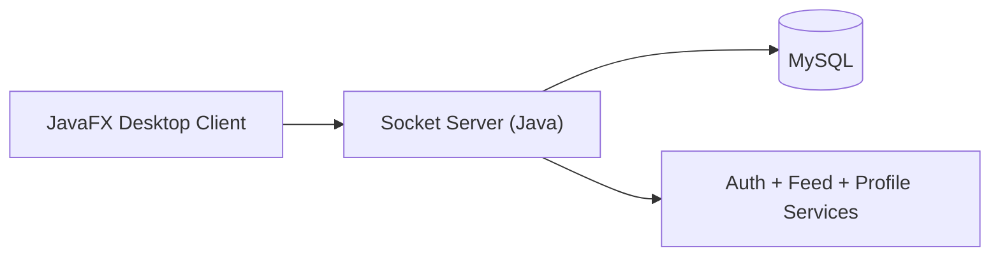
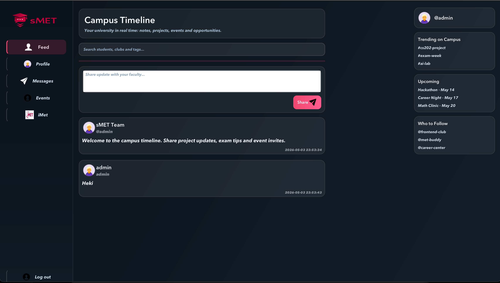
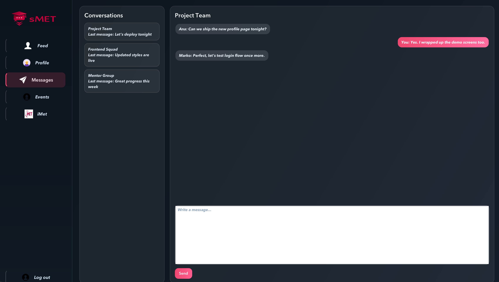

<p align="center">
  
</p>

<h1 align="center">sMET</h1>
<p align="center"><strong>Socijalna mreža za Univerzitet Metropolitan — sMET 2.0</strong></p>

<p align="center">
  
  
  
  
  
  
  
</p>

## What Is sMET?
sMET is a university social network built as a focused, campus-first timeline app.
It enables students to share short updates, discover events, follow people, and stay connected with faculty life in one desktop experience.

The 2.0 iteration modernizes both the visual layer and core flow architecture for better usability and maintainability.

## Technical Improvements In This Release
This version introduces a substantial UI/UX rebuild and project stabilization.

- Rebuilt key UI pages into a cleaner, modern component structure (`Login`, `Feed`, `Profile`, `Messages`, `Events`, `Settings`).
- Replaced legacy fixed-position layouts with more responsive container-based layouts (`VBox`/`HBox`/`FlowPane`/`ScrollPane`).
- Introduced a unified visual language (cards, spacing, typography, gradients, interaction states).
- Added campus-focused timeline experience with right-rail widgets (`Trending`, `Upcoming`, `Who to Follow`).
- Standardized asset loading and replaced machine-specific absolute file paths.
- Added environment-variable based DB configuration for easier local setup:
  - `SMET_DB_URL`
  - `SMET_DB_USERNAME`
  - `SMET_DB_PASSWORD`
- Added database schema script for reproducible setup: `database/schema.sql`.

## Core Experience
- **Campus Timeline**: real-time stream for project updates, tips, and event invites.
- **People Discovery**: search students and open profile views directly from feed.
- **Messaging Demo Space**: conversation-oriented UI for direct communication flow.
- **Events Demo Space**: card-based upcoming events experience.
- **Profile + Settings**: editable social identity (bio and links) with updated UX.

## Architecture At A Glance
sMET follows a desktop client + socket server + relational persistence architecture.



## Project Layout
```text
sMET/
├── assets/                      # App icons, logos, visual resources
├── database/
│   └── schema.sql               # DB schema bootstrap script
├── docs/
│   └── assets/                  # README branding and screenshots
├── src/main/java/
│   ├── GUI/                     # JavaFX scenes/components
│   ├── networking/              # Socket client/server + DB utility
│   └── Posts/                   # Post UI models/components
├── src/main/resources/          # CSS styling
├── pom.xml                      # Maven build config
└── mvnw                         # Maven wrapper
```

## Getting Started
### 1. Prerequisites
- JDK 21+
- MySQL 8+
- Maven wrapper (included)

### 2. Initialize database
```bash
mysql -u root -p < database/schema.sql
```

### 3. Configure environment variables
```bash
export SMET_DB_URL="jdbc:mysql://localhost:3306/iMetDatabase"
export SMET_DB_USERNAME="root"
export SMET_DB_PASSWORD="1234"
```

### 4. Build project
```bash
./mvnw -q -DskipTests compile
```

### 5. Start server
```bash
./mvnw -q -DskipTests org.codehaus.mojo:exec-maven-plugin:3.5.0:java -Dexec.mainClass=networking.Server
```

### 6. Start JavaFX client
```bash
./mvnw -q javafx:run
```

## Local Runtime Notes
- Client host: `localhost`
- Server port: `8080`
- DB name: `iMetDatabase`

Login behavior in current build:
- If user does not exist, app auto-creates account on first sign-in attempt.
- Existing user login validates via BCrypt hash check.

## Screenshots
### Campus Timeline
<p align="center">
  
</p>

### Messages
<p align="center">
  
</p>

## Mini Roadmap To Full Release
### Phase 1: Product Hardening
- Improve validation and error surfaces for auth/profile flows.
- Add stronger null/connection handling in networking edge cases.
- Expand test coverage for feed and profile logic.

### Phase 2: Campus Social Features
- Introduce likes, replies, and repost-style interactions.
- Add richer event workflows (RSVP, reminders, event ownership).
- Improve messaging model from demo UI to persisted conversations.

### Phase 3: Platform Maturity
- Add notifications and smarter recommendation rail.
- Add analytics/insights panel for engagement trends.
- Prepare packaging/distribution profile for desktop delivery.

## Release Note
sMET 2.0 represents a major modernization milestone with a full UI refresh, improved layout responsiveness, and cleaner project setup for continued development.

## Final Note
<p align="center">
  
</p>
<p align="center"><strong>sMET — education, community, momentum.</strong></p>
